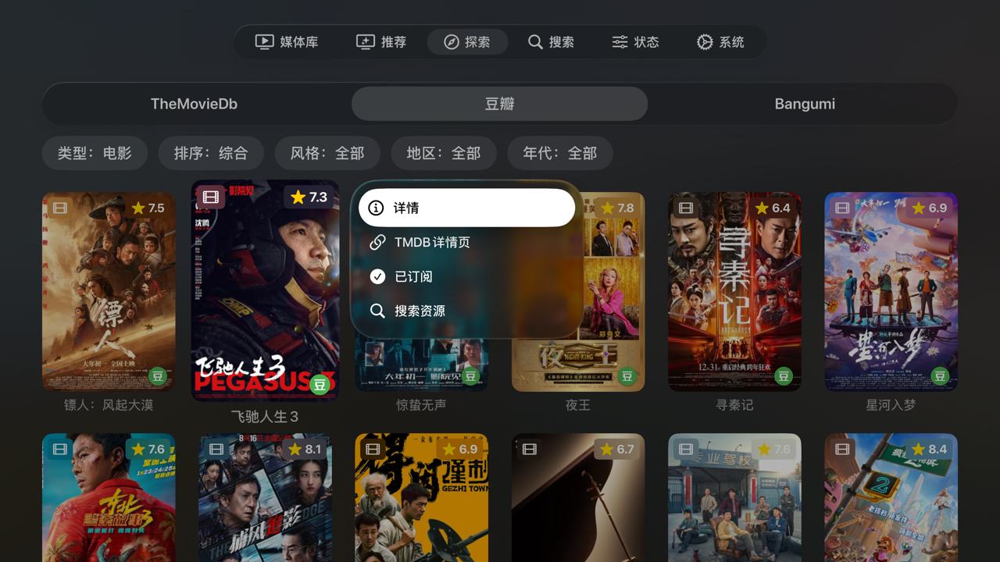
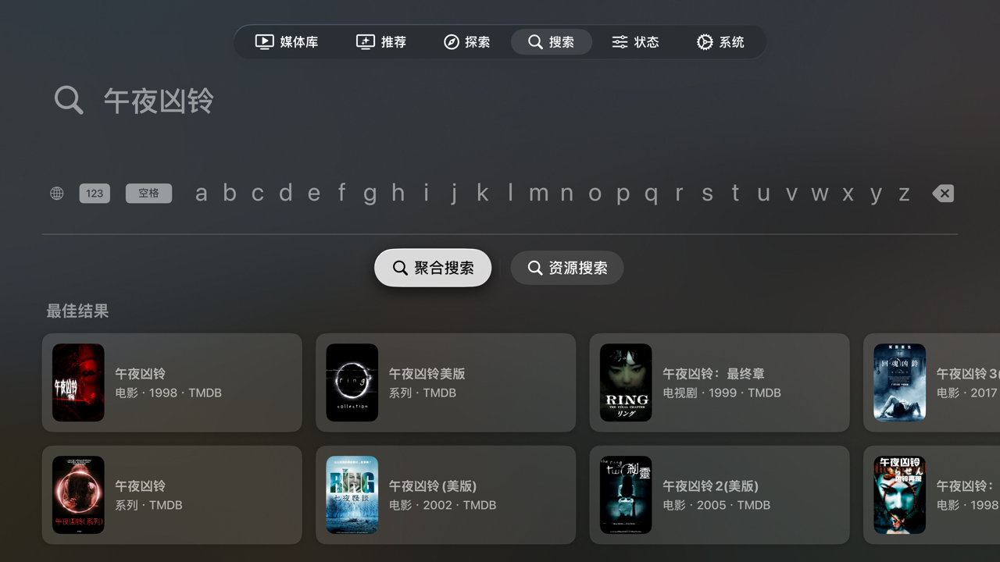
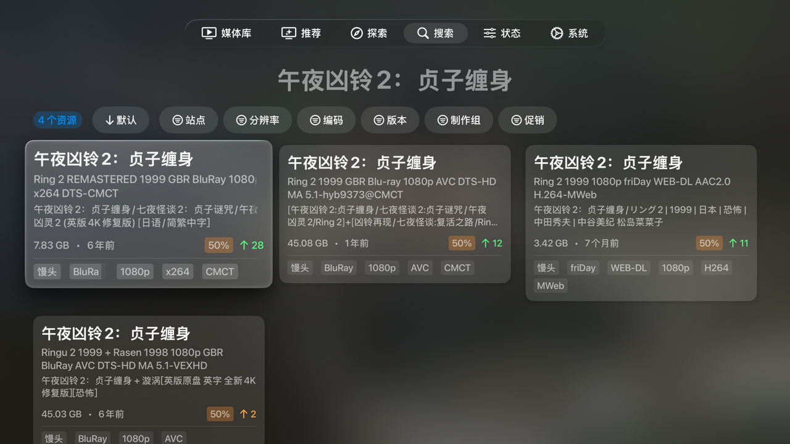
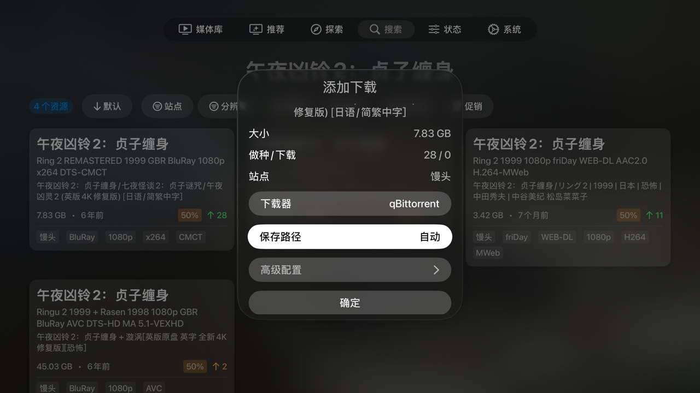
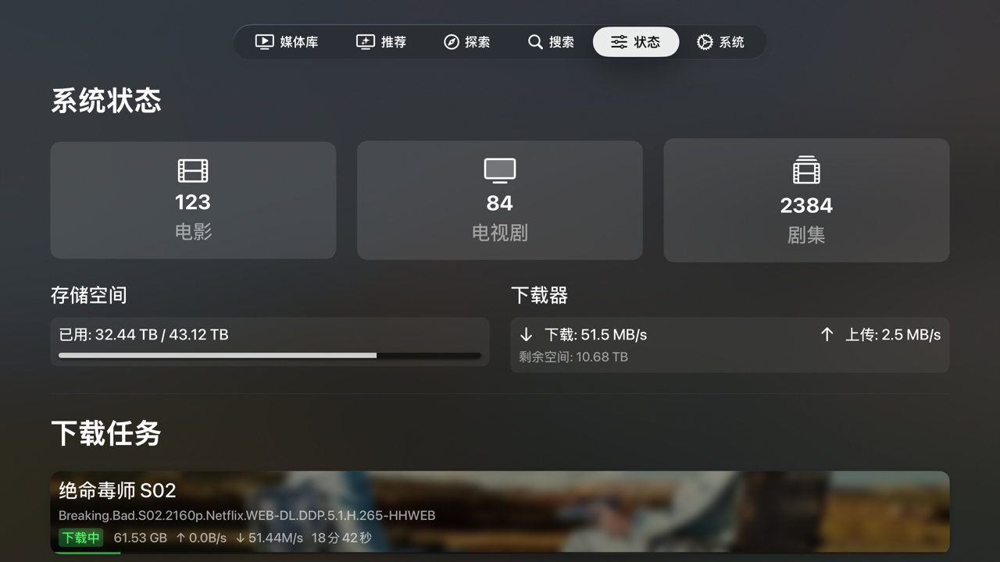

# MoviePilot-TV

<p align="center">
  <a href="https://github.com/CHANTXU64/MoviePilot-TV/releases"></a>
  <a href="https://github.com/jxxghp/MoviePilot"></a>
  
  
  
  <a href="https://github.com/CHANTXU64/MoviePilot-TV/blob/main/LICENSE"></a>
  <a href="https://github.com/CHANTXU64/MoviePilot-TV/issues"></a>
</p>

基于 Swift 和 SwiftUI 开发的 **MoviePilot** Apple TV 原生客户端。为大屏幕和 Siri Remote 遥控器交互而设计。

## 界面预览

<p align="center">
  
  
  
  
  
  
  
  
  
  
  
  
</p>

## 核心特性

专为大屏幕和家庭观影设计，提供从浏览、搜索到订阅的完整闭环体验。

- **为家庭设计**: 聚焦核心观影功能，摒弃复杂的管理员后台设置，交互简洁，适合所有家庭成员。
- **原生沉浸体验**: 基于 Swift & SwiftUI 原生开发，遵循 tvOS 设计规范，提供流畅的动效和沉浸式详情页。
- **Siri Remote 完整支持**: 所有功能均可通过 Siri Remote 直观操作，支持长按海报进行订阅、搜索等快捷操作。
- **聚合搜索**: 一键搜索电影、电视剧、合集及演职人员。
- **高效订阅**: 优化订阅流程，在订阅时直接完成配置，一步到位。
- **无缝浏览**: 通过详情页预加载和持久化登录，消除等待，实现无缝切换和快速访问。

## ⚠️ 兼容性与已知问题

- **tvOS 版本**: 支持 **tvOS 18.0+**。本项目主要在 **tvOS 26.0+** 环境下开发，建议使用最新的 tvOS 系统获得最佳体验。
- **MoviePilot 版本**: 当前测试兼容的后端版本为 `v2.14.0`。低于该版本的后端可能出现严重功能异常、数据丢失或闪退；App 启动时会提示风险，但用户仍可选择继续使用。
- **兼容原则**: TV 端以 MoviePilot Web 前端和 MoviePilot 后端当前行为为准；如果 Web 本来也不显示，或后端/第三方数据源同样异常，本项目通常不会在 TV 端额外兜底修复。
- **更新节奏**: 本应用更新频率可能低于 MoviePilot 原版，不保证长期兼容旧版 API 或旧版后端已知问题。
- **账号登录**: **不支持**已开启双因素认证 (MFA/2FA) 的账号，请在关闭双因素认证后再登录。
- **账号权限**: 至少要求账号具备探索、搜索和订阅权限。

## 安装指南

> [!IMPORTANT]
> **关于通过官方渠道分发 (App Store / TestFlight)**
> 
> 本项目当前仅支持通过 Xcode 源码构建和安装。
> 
> 若计划通过 TestFlight 或 App Store 进行分发，贡献者需了解以下前提与风险：
> 
> 1.  **开发者计划费用**: 分发需要一个年费为 99 美元的 Apple Developer Program 成员资格。
> 2.  **代码修改工作**: 为通过审查，需要投入精力对现有代码进行调整以满足 [App Store 审查指南](https://developer.apple.com/app-store/review/guidelines/) 的要求。
> 3.  **审查与账号风险**: 提交的应用仍可能被 App Review 拒绝。在极端情况下，违规行为可能导致开发者账号被禁。
> 
> 欢迎有意协助推进官方分发的贡献者，在 Issues 发起讨论。

### Xcode 源码构建 (当前唯一方式)

#### 准备工作
- macOS 26.0+
- Xcode 26.0+

#### 构建步骤
1. 克隆项目代码：
   ```sh
   git clone --filter=blob:none https://github.com/CHANTXU64/MoviePilot-TV.git

   # 切到最新 tag (例如 v0.3.3)
   git checkout tags/v0.3.3
   ```
2. 使用 Xcode 打开 `MoviePilot-TV.xcodeproj`。
3. 选择你的真实 Apple TV 设备（需在同一局域网并已配对）。
4. 在 **Signing & Capabilities** 中选择你的开发者账号，修改 `Bundle Identifier` 为一个唯一的名称（例如 `com.yourname.MoviePilot-TV`）。
5. 点击 **Run** (或 `Cmd + R`) 编译并安装。
6. 自动续签 (可选): 免费账号签名的应用有效期通常为 7 天，可使用 [Sideloadly](https://sideloadly.io/) 或项目内的 `scripts/apple-tv-renew.sh` 续签：
   ```sh
   BUNDLE_ID="com.yourname.MoviePilotTV" bash scripts/apple-tv-renew.sh
   BUNDLE_ID="com.yourname.MoviePilotTV" bash scripts/apple-tv-renew.sh --force
   ```

   **注意：** 脚本默认只检查本机 DerivedData 中构建产物的 `embedded.mobileprovision`，不会确认 Apple TV 设备端是否仍安装成功；如果本机构建产物里的签名配置仍未过期，脚本会直接跳过。`--force` 会忽略这个本地未过期检查，直接重新构建并安装到已配对的 Apple TV，适合放进 crontab 定时保活或怀疑设备端安装状态异常时使用。

   `--force` 只强制执行构建和安装流程，不代表 Xcode/Apple 一定会在旧的 Xcode-managed provisioning profile 过期前签发新的 profile；如果 Apple 仍复用未过期的 profile，应用的实际到期时间不会被提前延长。

## 后端兼容性测试

如需使用自己的 MoviePilot 后端验证 TV 端接口、图片和功能兼容性，请先阅读 [后端兼容性测试文档](docs/backend-compatibility-tests.md)。真实后端测试可能包含副作用套件，运行前请确认测试范围。

## 反馈与贡献

- **提交 Bug**：请务必提供 MoviePilot 版本号、相关截图和复现步骤。
- **功能建议**：本项目专注提供基础的客厅浏览和订阅体验，过于复杂的后端配置管理等需求暂不考虑。
- **贡献代码**：代码采用纯 Swift 编写。提交 PR 前请确保在真实 Apple TV 上测试过。

## 协议声明

本项目原创代码基于 **[CC0 1.0 Universal](LICENSE)** 协议发布（公有领域）。可自由复制、修改、发布和商业使用。

## 鸣谢

界面及交互设计参考了 **[MoviePilot-Frontend](https://github.com/jxxghp/MoviePilot-Frontend)** 与 Apple TV 官方应用，对相关开发者表示感谢。原项目的相关参考代码和逻辑遵循原作者的 **MIT License**。
