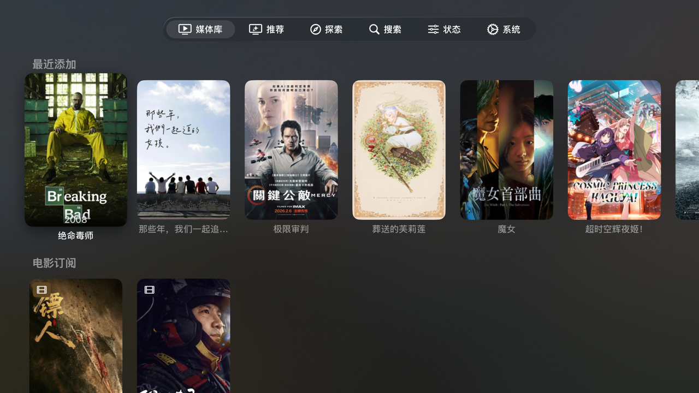
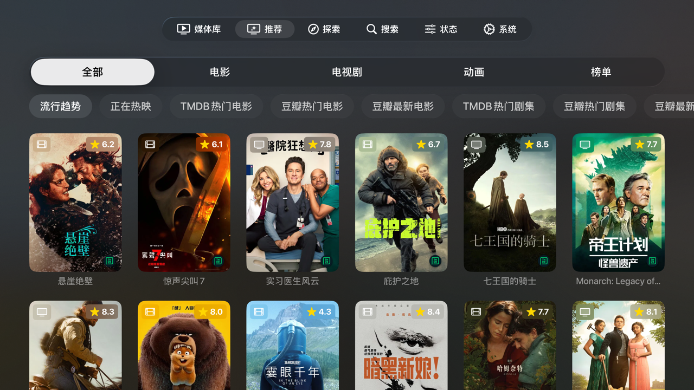
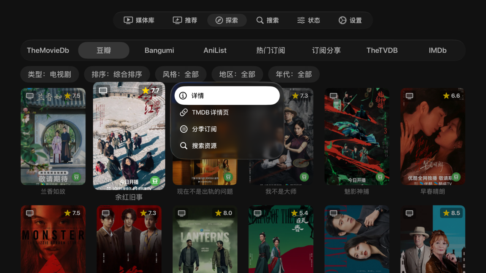
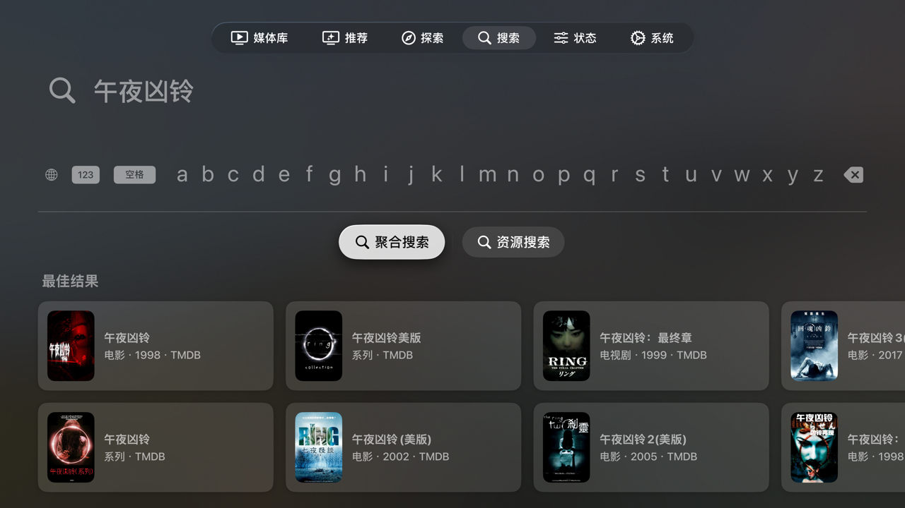
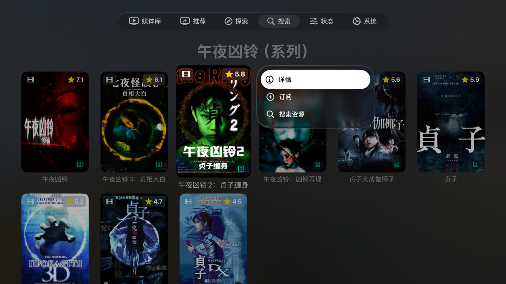
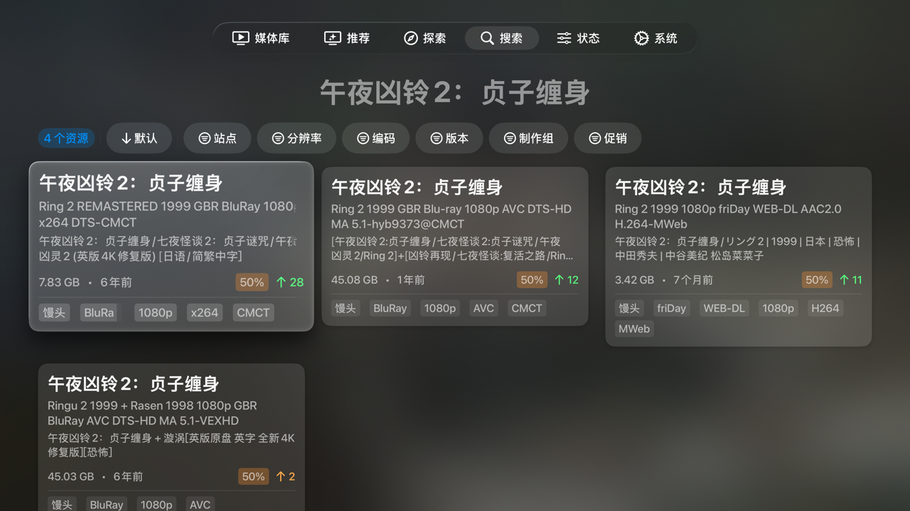
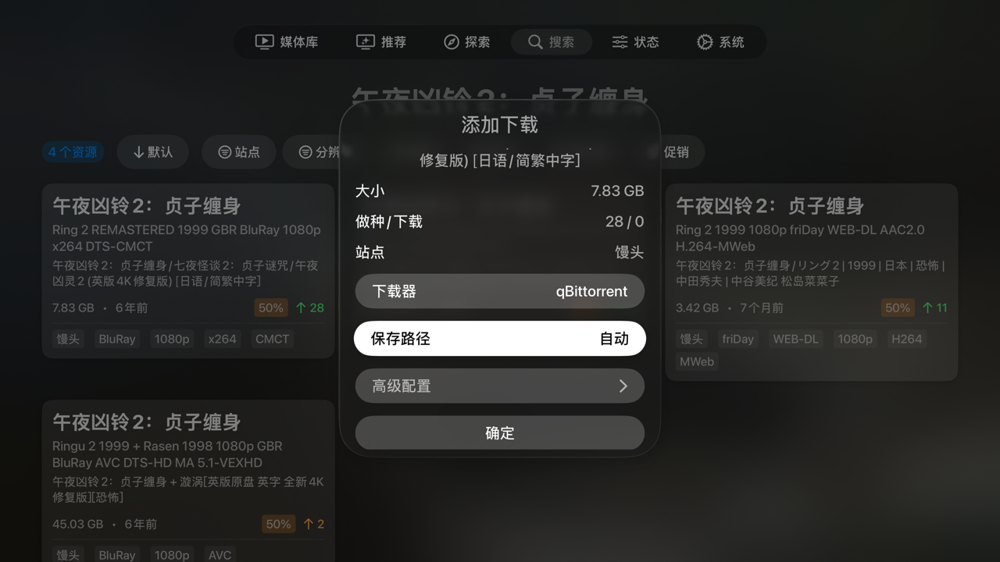
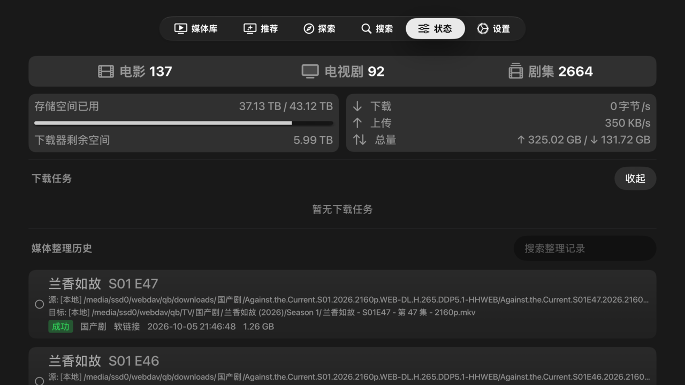

# MoviePilot-TV

<p align="center">
  <a href="https://github.com/CHANTXU64/MoviePilot-TV/releases"></a>
  <a href="https://github.com/jxxghp/MoviePilot"></a>
  
  
  
  <a href="https://github.com/CHANTXU64/MoviePilot-TV/blob/main/LICENSE"></a>
  <a href="https://github.com/CHANTXU64/MoviePilot-TV/issues"></a>
</p>

基于 Swift 和 SwiftUI 开发的 **MoviePilot** Apple TV 原生客户端。为大屏幕和 Siri Remote 遥控器交互而设计。

## 界面预览

<p align="center">
  
  
  
  
  
  
  
  
  
  
  
  
</p>

## 核心特性

专为大屏幕和家庭观影设计，提供从浏览、搜索到订阅的完整闭环体验。

- **为家庭设计**: 聚焦核心观影功能，摒弃复杂的管理员后台设置，交互简洁，适合所有家庭成员。
- **原生沉浸体验**: 基于 Swift & SwiftUI 原生开发，遵循 tvOS 设计规范，提供流畅的动效和沉浸式详情页。
- **Siri Remote 完整支持**: 所有功能均可通过 Siri Remote 直观操作，支持长按海报进行订阅、搜索等快捷操作。
- **聚合搜索**: 一键搜索电影、电视剧、合集及演职人员。
- **高效订阅**: 优化订阅流程，在订阅时直接完成配置，一步到位。
- **无缝浏览**: 通过详情页预加载和持久化登录，消除等待，实现无缝切换和快速访问。

## ⚠️ 兼容性与已知问题

- **tvOS 版本**: 支持 **tvOS 18.0+**。本项目主要在 **tvOS 26.0+** 环境下开发，建议使用最新的 tvOS 系统获得最佳体验。
- **MoviePilot 版本**: 已兼容 **v3.0.4**、**v3.0.5**、**v3.0.7**、**v3.0.10**、**v3.0.10-1**、**v3.1.0**、**v3.1.1**、**v3.1.2**、**v3.1.2-1**。使用其他版本时，打开 App 会提示一次，仍可继续使用。v3.0.4 上不能复用订阅（MoviePilot 上游问题，v3.0.5 已修复）。详见[后端版本兼容维护](docs/backend-version-compatibility.md)。
- **兼容原则**: TV 端以 MoviePilot Web 前端和 MoviePilot 后端当前行为为准；如果 Web 本来也不显示，或后端/第三方数据源同样异常，本项目通常不会在 TV 端额外兜底修复。
- **更新节奏**: 本应用更新频率可能低于 MoviePilot 原版，不保证长期兼容旧版 API 或旧版后端已知问题。
- **账号登录**: **不支持**已开启双因素认证 (MFA/2FA) 的账号，请在关闭双因素认证后再登录。
- **密码安全**: 请勿将 MoviePilot 密码与其他服务的密码设为相同值。Apple 钥匙串不可用时，本 App 会自动降级为明文持久化密码；即使 Apple TV 环境相对封闭，仍存在密码泄露风险。

## 安装指南

### 方式一：下载 IPA 并自签侧载

前往项目的 [Releases](https://github.com/CHANTXU64/MoviePilot-TV/releases)，下载最新版本中的：

```text
MoviePilot-TV-unsigned.ipa
```

该文件需要使用自己的 Apple 账号或证书重新签名后，才能安装到 Apple TV。

可使用支持 tvOS 应用签名和侧载的工具进行安装，例如：

- [ATVloadly](https://github.com/bitxeno/atvloadly)
- 其他支持 tvOS IPA 重签名及侧载的工具

只需安装这一个 IPA，已包含 Top Shelf（Apple TV 首页推荐）功能。如果安装工具有“移除扩展”选项，请不要勾选。

[Issue#1](https://github.com/CHANTXU64/MoviePilot-TV/issues/1) 中已有用户确认，通过部署在 NAS 上的 ATVloadly，可以正常完成安装并使用。

### 方式二：社区 TestFlight 苹果测试渠道

社区用户 [EricCartman9969](https://github.com/EricCartman9969) 提供了个人 TestFlight，可通过以下链接加入：

https://testflight.apple.com/join/UK3qEnVU

> [!WARNING]
> 该 TestFlight 由社区用户自行维护，并非本项目官方发布渠道。
>
> 不保证长期更新、持续可用或与最新源码版本保持一致；测试名额、构建有效期及后续维护均由提供者决定。

### 方式三：通过 Xcode 源码构建

#### 准备工作
- macOS 26.0+
- Xcode 26.0+

#### 构建步骤
1. 克隆项目代码：
   ```sh
   git clone --filter=blob:none https://github.com/CHANTXU64/MoviePilot-TV.git

   # 切到最新 tag (例如 v0.3.9)
   git checkout tags/v0.3.9
   ```
2. 使用 Xcode 打开 `MoviePilot-TV.xcodeproj`。
3. 选择你的真实 Apple TV 设备（需在同一局域网并已配对）。
4. 为主 App 和 Top Shelf 扩展在 **Signing & Capabilities** 中选择自己的同一开发者团队，并在项目 **Build Settings** 中设置 `APP_BUNDLE_IDENTIFIER`（例如 `com.yourname.MoviePilotTV`）。主 App 使用此标识，扩展使用其 `.TopShelf` 子标识。
   项目级 `APP_GROUP_IDENTIFIER` 默认派生为 `group.$(APP_BUNDLE_IDENTIFIER)`，例如 `group.com.yourname.MoviePilotTV`；两个 target 的 entitlements、共享缓存和共享 Keychain 都使用这个值。确认该 Group 已[注册到自己的团队](https://developer.apple.com/help/account/identifiers/register-an-app-group)，并为两个 App ID 启用对应的 App Groups 授权；Xcode 自动签名可管理这些配置。已有自己团队的 Group 时，只需在项目级覆盖 `APP_GROUP_IDENTIFIER`，不要分别修改 entitlements 或 Swift 常量，也不要全局覆盖 `PRODUCT_BUNDLE_IDENTIFIER`。
5. 点击 **Run** (或 `Cmd + R`) 编译并安装。
6. 自动续签 (可选): 免费账号签名的应用有效期通常为 7 天，可使用 [Sideloadly](https://sideloadly.io/) 或项目内的 `scripts/apple-tv-renew.sh` 续签：
   ```sh
   BUNDLE_ID="com.yourname.MoviePilotTV" bash scripts/apple-tv-renew.sh
   BUNDLE_ID="com.yourname.MoviePilotTV" bash scripts/apple-tv-renew.sh --force
   ```

   脚本会检查本机已有构建中主 App 和 Top Shelf 的签名，全部有效时会跳过。需要重新构建和安装时加上 `--force`；重新构建不保证延长签名有效期。高级配置见[签名与打包说明](docs/signing-and-packaging.md#源码构建与续签)。

## 开发与测试

本机验证运行 `python3 scripts/test-tvos.py`，自动使用临时测试模拟器；Xcode Test 也使用独立测试 App，避免覆盖日常登录数据。完整命令见 [AGENTS.md](AGENTS.md)，签名、Top Shelf 和发布打包的技术细节见[签名与打包说明](docs/signing-and-packaging.md)。

### 后端兼容性测试

如需使用自己的 MoviePilot 后端验证 TV 端接口、图片和功能兼容性，请先阅读 [后端兼容性测试文档](docs/backend-compatibility-tests.md)。真实后端测试可能包含副作用套件，运行前请确认测试范围。

### UI 预览测试分支

UI 预览测试请切到 `ai/ui-preview-mode` 分支，该分支不计划合并到 `main`。Debug 构建运行时添加启动参数 `-uiPreviewMode`。

## 反馈与贡献

- **提交 Bug**：请务必提供 MoviePilot 版本号、相关截图和复现步骤。
- **功能建议**：本项目专注提供基础的客厅浏览和订阅体验，过于复杂的后端配置管理等需求暂不考虑。
- **贡献代码**：代码采用纯 Swift 编写。提交 PR 前请确保在真实 Apple TV 上测试过。

## 协议声明

本项目原创代码基于 **[CC0 1.0 Universal](LICENSE)** 协议发布（公有领域）。可自由复制、修改、发布和商业使用。

## 鸣谢

界面及交互设计参考了 **[MoviePilot-Frontend](https://github.com/jxxghp/MoviePilot-Frontend)** 与 Apple TV 官方应用，对相关开发者表示感谢。原项目的相关参考代码和逻辑遵循原作者的 **MIT License**。
